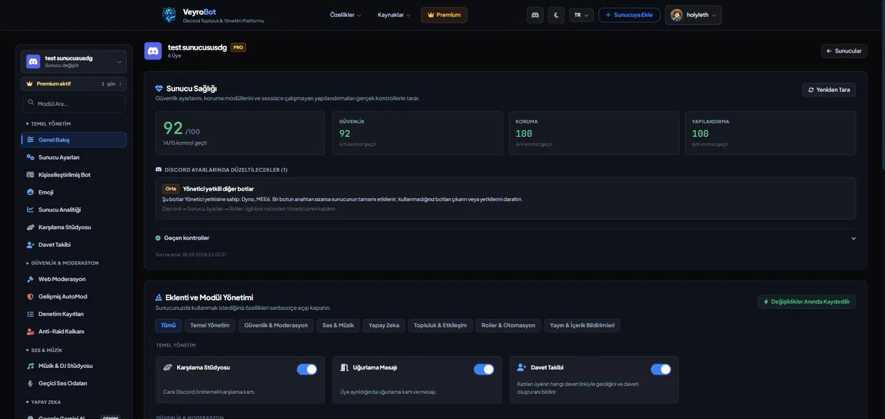
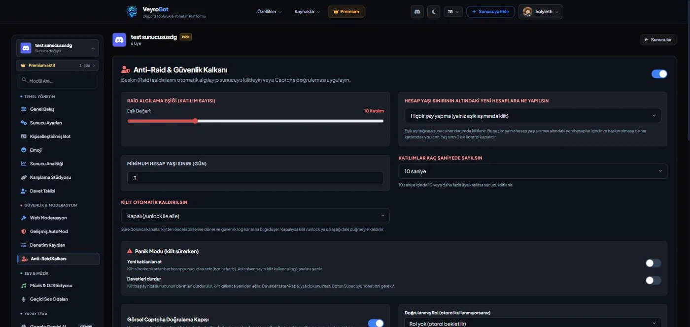
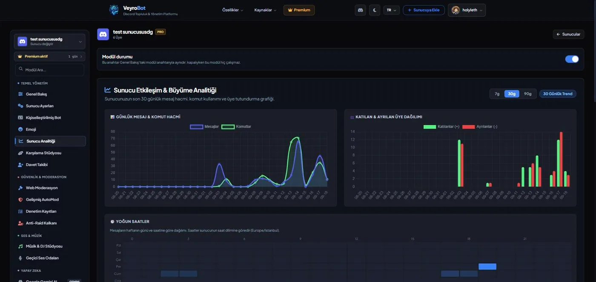
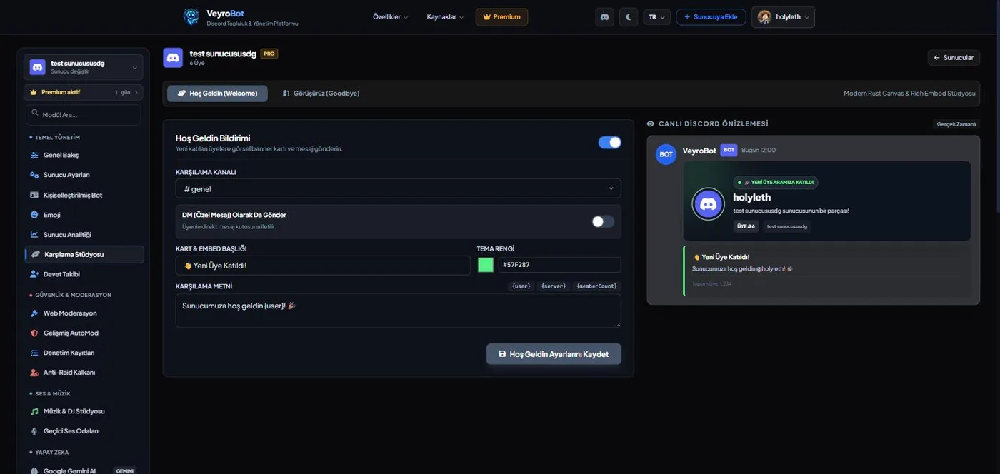
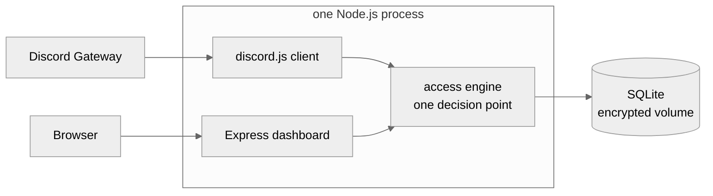

# VeyroBot

**Stop stacking bots. Run your Discord server from one control center.**

Moderation, anti-nuke, automod, tickets, leveling, music, stream alerts across eight platforms,
scheduled messages and analytics — one web panel, one permission model, one database.

This repository is a public overview of the product. <b>The source code is not published here.</b>

---

## The problem

Most servers end up running five different bots: one for moderation, one for tickets, one for
leveling, one for stream alerts, one for music. Five dashboards, five permission systems, five
things that break independently, and no single place that knows what your server actually looks like.

VeyroBot is the other approach: **one bot, one panel, one database** — and a panel that reads the
bot's live state instead of a copy of it.

---

## What it looks like

### Server Health — a real score, not a vanity number

Scans your Discord permissions, protection modules and misconfigurations, and tells you exactly what
is wrong and where to fix it. One-click fixes with a 24-hour undo window.

### Anti-Raid Shield

Join-rate thresholds trigger an automatic lockdown; `/unlock` restores every channel's original
permissions from a snapshot taken before the lock.

### Analytics that answer questions

Message volume, command usage, member retention, join/leave breakdown and activity heatmaps —
rendered in your server's own timezone. Scheduled daily, weekly or monthly reports to a channel.

### Welcome Studio with a live preview

Design the welcome card and see the actual Discord message render as you type.

---

## Features

| Area | What's included |
|---|---|
| **Security** | Anti-nuke with audit-log thresholds and one-click role restoration · anti-raid lockdown · recommended security setup with undo · server backup |
| **Moderation** | Warning tiers with automatic penalties · timeout, kick, ban · full audit logging · web moderation from the panel |
| **AutoMod** | Discord-native AutoMod rules configured from the panel, plus VeyroBot's own filters |
| **Members** | Welcome and goodbye cards · autoroles · timed reaction roles · leveling and voice XP · birthdays · achievements · invite tracking |
| **Notifications** | YouTube, Twitch, Kick, Reddit, Bluesky, RSS and podcasts — one card template, live stream cards that update and close out |
| **Community** | Tickets with typed categories · application forms · suggestions · giveaways · starboard · sticky messages · custom commands |
| **Scheduling** | Timed messages · reminders · events · automated analytics reports |
| **More** | Music with a DJ studio · Google Gemini AI · stats channels · emoji gallery · setup wizard |

Every module can be turned on or off individually, and access is decided in one place rather than
scattered across the codebase.

---

## How it's built

VeyroBot runs as **a single Node.js process**. The Discord bot and the Express web panel are not
separate services — they share the same live `discord.js` client and the same SQLite handle.

That means the panel never shows stale state, because there is no copy to fall out of sync. It also
means a mistake in a web route can take the bot down with it, which is a tradeoff made on purpose
rather than by accident.

A few things that are deliberate:

- **The dashboard runs under an enforced Content-Security-Policy** with no `unsafe-inline`. Every
  event handler lives in an external file. Stricter than required, on purpose.
- **Data at rest sits on an encrypted volume**, and the service refuses to start if that volume
  isn't mounted — a bot that won't boot beats a bot that boots on an empty database.
- **Payment webhooks** are verified by signature, checked for idempotency, and matched against the
  store before anything is granted.
- **Seven interface languages** — Turkish, English, Spanish, German, Portuguese, Russian, Hindi —
  with no partially translated pages.

---

## Links

| | |
|---|---|
| Website | [veyrobot.xyz](https://veyrobot.xyz) |
| Documentation | [veyrobot.xyz/docs](https://veyrobot.xyz/docs) |
| Command list | [veyrobot.xyz/commands](https://veyrobot.xyz/commands) |
| Release notes | [veyrobot.xyz/changelog](https://veyrobot.xyz/changelog) |
| Status | [veyrobot.xyz/status](https://veyrobot.xyz/status) |
| Support server | [discord.gg/NKYe4WbyaN](https://discord.gg/NKYe4WbyaN) |

---

## About this repository

This repository exists to document and present the product. **It contains no source code**, and none
is planned. VeyroBot is proprietary software — see [NOTICE](NOTICE.md).

Found a bug or have a feature request? The [support server](https://discord.gg/NKYe4WbyaN) is the
fastest route; issues here are welcome too.

© VeyroBot · All rights reserved

